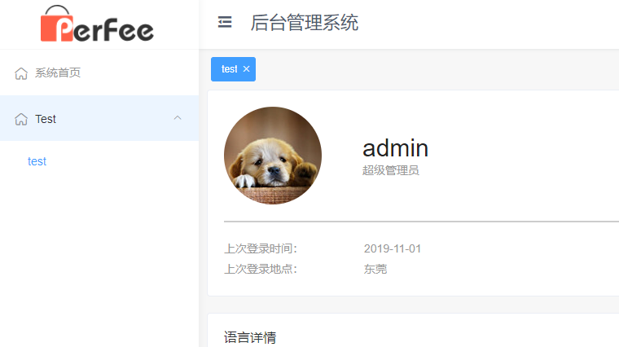

## 产品线后台
项目使用Vue3 + element-plus构建

### 相关文档：

[vue3中文官方文档](https://vue3js.cn/docs/zh/)

[vuex中文官方文档](https://vuex.vuejs.org/zh/)

[element-plus官方文档](https://element-plus.gitee.io/#/zh-CN/component/installation)

[vxe-table(处理复杂表格)](https://xuliangzhan_admin.gitee.io/vxe-table/v4/table/start/upgrade)

[loadsh官方文档](https://www.lodashjs.com/)

[i18n官方文档](https://kazupon.github.io/vue-i18n/zh/)

[工具函数库文件（所有函数都带有注释）](./src/utils/utils.js)

[校验函数库（所有函数都带有注释）](./src/utils/verification.js)

### 环境构建
```
npm install || yarn install
```

```
npm run serve || yarn serve // RUN_NODE_ENV = dev
```

```
npm run build || yarn build // RUN_NODE_ENV = prod
```

### 基础规范及注意事项
```
1. 组件规范：
    1) 请使用最新的组合式api setup() 进行组件的实现
    2) 组件命名使用 大驼峰，例：BetterScroll.vue（不要写成betterScroll.vue 或 better-scroll.vue）
    3）模板中使用自定义组件使用 大驼峰(<BetterScroll>, 有利于编辑器提示)，element组件使用 <el-col></el-col>
    4) 组件的props请定义格式
    5) element各类表单组件的size，若无特殊情况，请统一使用small
2. js规范：
    1) 尽量使用es语法
    2) 遵循eslint规范
3. css规范：
    1) css请统一使用scss
    2) 除非特殊需要，一般情况下组件样式请加<style scoped></style>
    3) 非必要情况下请不要随意定义全局 css样式
    4) 全局css样式请增加统一前缀：sx-xxx
4. 其他
    · vue-router、vuex、api 等请按照需求进行模块拆分，非公共模块请不要写在index.js中
    · 变量、国际化、常量、方法命名请语义化，不要使用简拼、首字母简写等非人类操作，常量命名单词全部大写，下划线分割
    · loadsh请按需引入（因为整个loadsh库体积较大，且不需要使用到所有的方法）
    · 需要缓存的页面必须写 "name" 配置项，且 “name” 必须与路由中 “meta” 中配置的 “name”一致
    · 在整个项目中，需要使用货币单位与货币符号的地方，若需求无特殊说明，统一使用LocalStorage里存储的货币符号及单位
    · vxe-table体积过大 使用时请按需引入需要的组件
```

### Global Events （全局事件）
#### 事件名称：
```
reload: 刷新tags
close:tag：关闭 Tag 事件, [params: tagItem]:删除的tag
closeAll:tag：关闭所有的 Tags 事件
```
#### 事件使用说明
[event-emitter API文档](./src/utils/EVENT-EMITTER.md)
```js
// 引入 
import { useEmitter } from '@/utils/event-emitter'
setup() {
  const $emitter = useEmitter()

  $emitter.on(
    'close:tag',  // 事件名
    (e) => { console.log(e) } // 回调函数
  )
}
```

### 路由配置（目前最多只支持三级菜单【后续有需求的话会对sidebar进行改造】）

```js
// 配置示例：
export default [
  {
    path: '/dashboard',
    name: 'dashboard',
    meta: {
      title: '系统首页', icon: 'el-icon-lx-home'
    },
    component: () => import('@/views/Dashboard.vue')
  },
  {
    title: 'Test', // 一级菜单名称
    icon: 'el-icon-lx-home', // 一级菜单目录
    menuKey: 'key', // 多级菜单必须要有，切全局唯一
    children: [
        // 二级菜单
      {
        // 路由path 、 name
        path: '/test',
        name: 'test',
        meta: {
          // 最后一级菜单的 信息需要配置在 meta 元信息中
          title: 'test', icon: 'el-icon-lx-home', permission: 'admin:permission' // 权限
        },
        // 组件：尽量使用懒加载
        component: () => import('@/views/Dashboard.vue'),
        // 可以配置三级菜单
        // children: []
      }
    ]
  }
]
```

### 用户信息模块：
```js
// vuex state.userInfo:
userInfo: {
  token: "eyJ0eXAiOiJKV1QiLCJhbGciO.iJIUzI1NiJ9.SEH0DvIcn5n2DTIa920SzM"
  // 权限
  role: {
    isSuperuser: true, 
    permissions: []
  }
  // 用户相关信息
  userInfo: {
    username: "xedadmin",
    avatar: "",
    ......
  }
  ......
}
```

### 消息提示模块使用（utils/message.js）
#### api: 
```
useMessage: [type: Funtion] 注册Message模块（在 vue3 的 setup 函数中请使用此api获取message对象）

messageTip: [type: Funtion] 通用系统提示
sysSuccess: [type: Funtion]  系统提示【成功】
sysError: [type: Funtion]  系统提示【失败】
enduringMsg: [type: Funtion]  持久化提示（需要手动关闭或调用close方法，具体查看Element-plus文档）
messageError: [type: Funtion]  错误提示（会自动寻找 e.msg，
      可在调用接口的 catch 中直接使用：try{ ... } catch(e) { messageError(e) }）
```
#### vue3中非setup中使用(解释信息参考 api)
```
this.$messageTip(msg, type, options)
this.$sysSuccess()
this.$sysError()
this.$enduringMsg(msg, options)
this.$messageError(msg, options)
```

### 基础目录结构
```
perfee-manage-system
├─ .eslintrc.js // eslint规则配置
├─ .gitignore // git版本管理配置
├─ babel.config.js // babel插件配置
├─ jsconfig.json // vscode别名相关配置
├─ package.json // 包管理
├─ README.md // 项目说明文档
├─ README_EN.md
├─ src // 项目根目录
│  ├─ api // 所有的项目接口调用全部走这个目录
│  │  └─ index.js
│  ├─ App.vue // Vue根组件
│  ├─ assets // 静态资源目录
│  │  ├─ css
│  │  │  ├─ common.scss
│  │  │  ├─ icon.css
│  │  │  ├─ main.css
│  │  │  └─ theme
│  │  │     ├─ header.scss
│  │  │     ├─ mixin.scss
│  │  │     └─ sidebar.scss
│  │  └─ img
│  │     ├─ img.jpg
│  │     └─ login-bg.jpg
│  ├─ components // 通用组件模块
│  ├─ lang // 国际化模块
│  │  ├─ en
│  │  │  └─ system-languages.js
│  │  ├─ index.js
│  │  └─ zh-cn
│  │     └─ system-languages.js
│  ├─ layout // 后台框架布局
│  │  ├─ img
│  │  │  ├─ header-theme-dark.svg
│  │  │  ├─ header-theme-primary.svg
│  │  │  ├─ nav-theme-dark.svg
│  │  │  └─ nav-theme-light.svg
│  │  ├─ index.vue
│  │  └─ widgets
│  │     ├─ Header.vue
│  │     ├─ Sidebar.vue
│  │     ├─ Tags.vue
│  │     └─ Theme.vue
│  ├─ main.js // Vue项目入口
│  ├─ router // Vue路由
│  │  ├─ index.js
│  │  └─ modules // 模块路由
│  │     └─ system-routers.js
│  ├─ store // Vuex全局项目管理
│  │  ├─ index.js
│  │  └─ modules // Vuex全局状态模块化
│  │     └─ home.js
│  ├─ utils // 项目工具库
│  │  ├─ browserStore.js // store.js
│  │  ├─ permission.js // 权限
│  │  ├─ plugins.js // 项目插件
│  │  ├─ request.js // axios请求
│  │  └─ utils.js // 工具库
│  └─ views // 项目的页面
│     ├─ 403.vue
│     ├─ 404.vue
│     ├─ Dashboard.vue
│     └─ Login.vue
├─ vue.config.js // webpack相关配置信息
```